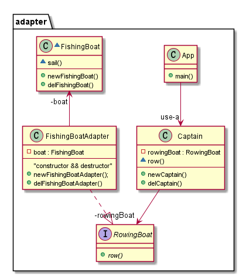

🔌Adapter
-----------
## Also known as
Wrapper

## Intent
Convert the interface of a class into another interface the clients expect.
Adapter lets classes work together that couldn't otherwise 
because of incompatible interfaces.

## Explanation

Real world example

> consider that you have some pictures in your memory card and
> you need to transfer them to your computer. In order to transfer 
> them you need some kind of adapter that is compatible with your 
> computer ports so that you can attach memory card to your computer.
> In this case card reader is an adapter.

> Another example would be the famous power adapter; a three legged plug
> can't be connected to a two pronged outlet, it needs to use a power 
> adapter that makes it compatible with the two pronged outlet.

> Yet another example would be a translator translating words spoken by 
> one person to another 

In plain words

> Adapter pattern lets you wrap an otherwise incompatible object in 
> an adapter to make it compatible with another clss.

Wikipedia says

> In software engineering, the adapter pattern is a software design pattern
> that allows the interface of an existing class to be used as another interface.
> It is often used to make existing classes work with others without 
> modifying their source code.

**Programmatic Example**
Consider a captain that can only use rowing boats and cannot sail at all.

First we have interface `RowingBoat` and `FishingBoat`
```c
#define class typedef struct
#define public
#define private
interface RowingBoat{
    void (*row)(void *);
}RowingBoat;

class FishingBoat{
    void (*sail)(void);
}FishingBoat;
FishingBoat *newFishingBoat(void);
void delFishingBoat(FishingBoat *self);
```
And captain expects an implementation of `RowingBoat` interface to be able to move
```c
class Captain{
    private RowingBoat *rowingBoat;
    void (*setRowingBoat)(RowingBoat *rowingBoat);
    void (*row)();
}Captain;
```  

Now let's say the pirates are coming and our captain needs to escape
but there is only fishing boat available. We need to create an adapter
that allows the captain to operate the fishing boat with his rowing boat skills.

```c
#define implements_RowingBoat
class FishingBoatAdapter implements_RowingBoat{
    RowingBoat super;
    private FishingBoat *boat;
}FishingBoatAdapter;
FishingBoatAdapter *newFishingBoatAdapter(void);
void delFishingBoatAdapter(FishingBoatAdapter *self);
```
And now the `Captain` can use the `FishingBoat` to escape the pirates.

```c
Captain *cap = newCaptain((RowingBoat*)newFishingBoatAdapter());
cap->row();
```
## Class diagram


## Applicability
Use the adapter pattern when
* you want to use an existing class, and its interface does not match the one
you need 
* you want to create a reuseable class that cooperates with unrelated or unforeseen
classes, that is, calsses that don't necessarily have compatible interfaces
* you need to use several existing subclasses, but it's impractical to adapt 
their interface by subclassing every one. An object adapter can adapt the interface
of its parent class.
* most of the applications using third party libraries use adapters as a middle lalyer
between the application and the 3rd party library to decouple the application from the 
library. If another library has to be used only an adapter for the new library is required
without having to change the application code.

## Consequences:
Class and object adapters have different trade-offs. A class adapter

*	adapts Adaptee to Target by committing to a concrete Adaptee class. As a consequence, a class adapter won’t work when we want to adapt a class and all its subclasses.
*	let’s Adapter override some of Adaptee’s behavior, since Adapter is a subclass of Adaptee.
*	introduces only one object, and no additional pointer indirection is needed to get to the adaptee.

An object adapter	

*	let’s a single Adapter work with many Adaptees—that is, the Adaptee itself and all of its subclasses (if any). The Adapter can also add functionality to all Adaptees at once.
*	makes it harder to override Adaptee behavior. It will require subclassing Adaptee and making Adapter refer to the subclass rather than the Adaptee itself.

## Credits

* [Design Patterns: Elements of Reusable Object-Oriented Software](http://www.amazon.com/Design-Patterns-Elements-Reusable-Object-Oriented/dp/0201633612)
