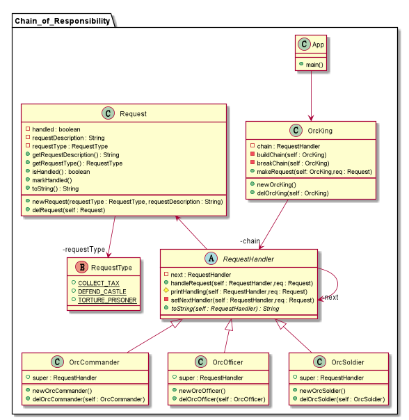

## Intent
Avoid coupling the sender of a request to its receiver by giving more than one 
object a chance to handle the request. Chain the receiving objects and pass the
request along the chain until an object handles it.

>使多个对象都有机会处理请求，从而避免了请求的发送者和接受者之间的耦合关系。
将这些对象连成一条链，并沿着这条链传递该请求，直到有对象处理它为止。

## Explanation
Real world example

> The Orc King gives loud orders to his army. The closest one to react is the 
> commander, then officer and then soldier. The commander, officer and soldier 
> here from a chain of responsibility.

In plain words

> It helps building a chain of objects. Request enters from one end and keeps 
> going from object to object till it finds the suitable handler.

Wikipedia says

> In object-oriented design, the chain-of-responsibility pattern is a design 
> pattern consisting of a source of command objects and a series of processing 
> objects. Each processing object contains logic that defines the types of 
> command objects that it can handle; the rest are passed to the next processing 
> object in the chain.

**Programmatic Example**

Translating our example with orcs from above. First we have the request class
```c

```

Then the request handler hierarchy
```c

```
Then we have the Orc King who gives the orders and forms the chain
```c

```

Then it is used as follows
```c

```

## Class diagram


## Applicability
Use Chain of Responsibility when

* more than one object may handle a request, and the handler isn't known a priori.
The handler should be ascertained automatically
* you want to issue a request to one of several objects without specifying the
receiver explicitly
* the set of objects that can handle a request should be specified dynamically

## Real world example
* [java.util.logging.Logger#log()](http://docs.oracle.com/javase/8/docs/api/java/util/logging/

## Credits
* [Design Patterns: Elements of Reusable Object-Oriented Software](http://www.amazon.com/Design-Patterns-Elements-Reusable-Object-Oriented/dp/0201633612)
