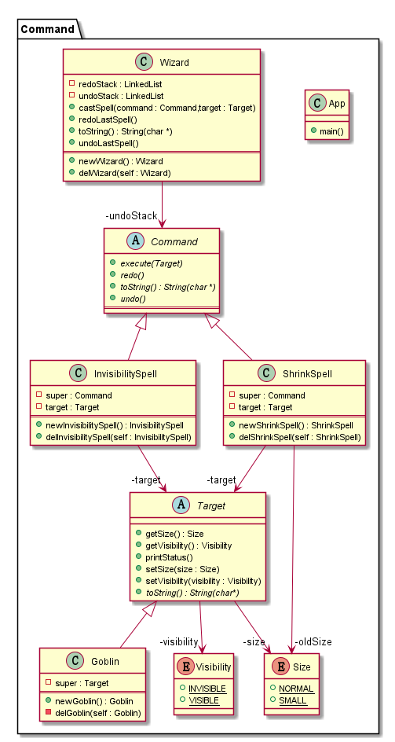

## Also known as
Action, Transaction

## Intent
Encapsulate a request as an object, thereby letting you 
parameterize clients with different requests, queue or 
log requests, and support undoable operations.
~~~~
将请求封装成对象，以便使用不同的请求、队列、
或日志将客户端参数化，同时提供可撤销功能。
~~~~
## Explanation

In plain words
Allows you to encapsulate actions in objects. The key idea behind this pattern is 
to provide the means to decouple client from receiver. 
>命令模式可以将“动作的请求者”从“动作的执行者”对象中解耦；
被解耦的二者之间通过命令对象进行沟通。

Wikipedia says
> In object-oriented programming, the command pattern is a behavioral design pattern
> in which an object is used to encapsulate all information needed to perform an 
> action or trigger an event at a later time. This information includes the method 
> name, the object that owns the method and values for the method parameters.

**Programmatic Example**

这个例子中有法师、妖精、咒语三个类，法师管理咒语的发放、撤销、并能保存施咒记录，妖精则为被咒语作用的对象。
```c
/**
 * Base class for spell target 抽象命令作用目标
 */
class Target Target;
public abstract class Target{
    private Size size;
    private Visibility visibility;
    public Size (*getSize)(Target *self);
    public void (*setSize)(Target *self,Size size);
    public void (*setVisibility)(Target *self,Visibility visibility);
    public Visibility (*getVisibility)(Target *self);
    public abstract char*(*toString)(Target *self);
    public void (*printStatus)(Target *self);
}Target;
/** default method -------------------------*/
public static Size getSize(Target *self){
    return self->size;
}
public static void setSize(Target *self,Size size){
    self->size = size;
}
public static Visibility getVisibility(Target *self){
    return self->visibility;
}
public static void setVisibility(Target *self,Visibility visibility){
    self->visibility = visibility;
}
public static void printStatus(Target *self){
    printf("%s [size = %s] [visibility = %s]\n",
    self->toString(self),self->getSize(self) ? "normal" : "small",
    self->getVisibility(self) ? "invisible" : "visible");
}
/** super 具体的命令作用目标继承的基类方法--------------------*/
static void initSuper(Target *super){
    super->setSize = setSize;
    super->getSize = getSize;
    super->setVisibility = setVisibility;
    super->getVisibility = getVisibility;
    super->printStatus = printStatus;
}
/**
 * Goblin is the target of the spells. 具体命令作用目标
 */
#define extends_Target
public class Goblin extends_Target{
    Target super;
}Goblin;
Goblin *newGoblin(void);
void delGoblin(Goblin *self);
/** definition-------------*/
/** @Override -------------------------*/
public static char* toString() {
    return "Goblin";
}
Goblin *newGoblin(void){
    Goblin *self = malloc(sizeof(Goblin));
    initSuper(&self->super);
    self->super.toString = toString;
    return self;
}
void delGoblin(Goblin *self){
    if (NULL != self){
        free(self);
        self = NULL;
    }
}
```
由咒语组成的类， 此处咒语即命令
```c
/**
 * Interface for Commands. 命令接口
 */
class Command Command;
public abstract class Command{
    public abstract void (*execute)(Command *super,Target *target);
    public abstract void (*undo)(Command *super);
    public abstract void (*redo)(Command *super);
    public abstract char* (*toString)();
}Command;

/**
 * InvisibilitySpell is a concrete command. 隐形咒命令
 */
#define extends_Command
public class InvisibilitySpell extends_Command{
    private Command super;
    private Target *target;
}InvisibilitySpell;
InvisibilitySpell *newInvisibilitySpell(void);
void delInvisibility(InvisibilitySpell *self);
/** definition ----------------------------------*/
/** @Override -------------------------*/
public static void execute(Command *super,Target *target){
    target->setVisibility(target,INVISIBLE);
    InvisibilitySpell *self = (InvisibilitySpell*)super;
    self->target = target;
}
public static void undo(Command *super){
    InvisibilitySpell *self = (InvisibilitySpell *)super;
    if (self->target != NULL){
        self->target->setVisibility(self->target,VISIBLE);
    }
}
public static void redo(Command *super){
    InvisibilitySpell *self = (InvisibilitySpell *)super;
    if (self->target != NULL){
        self->target->setVisibility(self->target,INVISIBLE);
    }
}
public static char* toString1() {
    return "Invisibility spell";
}
/** Constructor && Destructor */
InvisibilitySpell *newInvisibilitySpell(void){
    InvisibilitySpell *self = malloc(sizeof(InvisibilitySpell));
    self->super.toString = toString1;
    self->super.execute = execute;
    self->super.redo = redo;
    self->super.undo = undo;
    return self;
}
void delInvisibility(InvisibilitySpell *self){
    if (self != NULL){
        free(self);
    }
}

/**
 * ShrinkSpell is a concrete command.  缩小咒命令
 */
public class ShrinkSpell extends_Command{
    private Command super;
    private Size oldSize;
    private Target *target;
}ShrinkSpell;
ShrinkSpell *newShrinkSpell(void);
void delShrinkSpell(ShrinkSpell *self);
/** definition -------------------------------*/
/** @Override -------------------------*/
public static void execute1(Command *super,Target *target){
    ShrinkSpell *self = (ShrinkSpell *)super;
    self->oldSize = target->getSize(target);
    target->setSize(target,SMAll);
    self->target = target;
}
public static void undo1(Command *super){
    ShrinkSpell *self = (ShrinkSpell *)super;
    if (self->oldSize != -1 && self->target != NULL){
        Size temp = self->target->getSize(self->target);
        self->target->setSize(self->target,self->oldSize);
        self->oldSize = temp;
    }
}
public static void redo1(Command *super){
    super->undo(super);
}
public char *toString2(){
    return "Shrink spell";
}
/** Constructor && Destructor -------------*/
ShrinkSpell *newShrinkSpell(void){
    ShrinkSpell *self = malloc(sizeof(ShrinkSpell));
    self->super.toString = toString2;
    self->super.execute = execute1;
    self->super.redo = redo1;
    self->super.undo = undo1;
    return self;
}
void delShrinkSpell(ShrinkSpell *self){
    if (NULL != self){
        free(self);
    }
}
```
决定咒语的投放、撤销等操作的法师，即命令的调用者，管理命令的类
```c
/**
 * Wizard is the invoker of the commands.
 */
class Wizard Wizard;
public class Wizard {
    private LinkedList *undoStack;
    private LinkedList *redoStack;
    public void (*castSpell)(Wizard *self,Command *command,Target* target);
    public void (*undoLastSpell)(Wizard *self);
    public void (*redoLastSpell)(Wizard *self);
    public char *(*toString)();
}Wizard;
Wizard *newWizard(void);
void delWizard(Wizard *self);
/** definition --------------------------------------*/
/** member method ---------------------*/
// Cast spell.
public static void castSpell(Wizard *self,Command *command,Target *target){
    printf("%s casts %s at %s\n",self->toString(),command->toString(),target->toString(target));
    command->execute(command,target);
    self->undoStack->addAtTail(self->undoStack,command);
}
// undo last spell.
public static void undoLastSpell(Wizard *self){
    if (!self->undoStack->isEmpty(self->undoStack)){
        Command *previousSpell = self->undoStack->deleteAtIndex(self->undoStack,self->undoStack->size - 1);
        self->redoStack->addAtTail(self->redoStack,previousSpell);
        printf("%s undoes %s\n",self->toString(),previousSpell->toString());
        previousSpell->undo(previousSpell);
    }
}
// Redo last spell
public static void redoLastSpell(Wizard *self){
    if (!self->redoStack->isEmpty(self->redoStack)){
        Command *previousSpell = self->redoStack->deleteAtIndex(self->redoStack,self->redoStack->size - 1);
        self->undoStack->addAtTail(self->undoStack,previousSpell);
        printf("%s redoes %s\n",self->toString(),previousSpell->toString());
        previousSpell->redo(previousSpell);
    }
}
public static char* toString3(){
    return "Wizard";
}
/** Constructor && Destructor -------------*/
Wizard *newWizard(){
    Wizard *self = malloc(sizeof(Wizard));
    self->undoStack = createList();
    self->redoStack = createList();

    self->redoLastSpell = redoLastSpell;
    self->undoLastSpell = undoLastSpell;
    self->castSpell = castSpell;
    self->toString = toString3;
    return self;
}
void delWizard(Wizard *self){
    if (NULL != self){
        freeList(self->undoStack);
        freeList(self->redoStack);
        free(self);
    }
}
```
And then it can be used as
```c
Wizard *wizard = newWizard();
Target *goblin = (Target *)newGoblin();

goblin->printStatus(goblin);

Command *shrinkSpell = (Command*)newShrinkSpell();
Command *invisibilitySpell = (Command*)newInvisibilitySpell();
wizard->castSpell(wizard,shrinkSpell,goblin);
goblin->printStatus(goblin);

wizard->castSpell(wizard,invisibilitySpell,goblin);
goblin->printStatus(goblin);

wizard->undoLastSpell(wizard);
goblin->printStatus(goblin);

wizard->undoLastSpell(wizard);
goblin->printStatus(goblin);

wizard->redoLastSpell(wizard);
goblin->printStatus(goblin);

wizard->redoLastSpell(wizard);
goblin->printStatus(goblin);

delGoblin(goblin);
delShrinkSpell(shrinkSpell);
delInvisibility(invisibilitySpell);
delWizard(wizard);
```
运行结果为：

```
Goblin [size = normal] [visibility = visible]
Wizard casts Shrink spell at Goblin
Goblin [size = small] [visibility = visible]
Wizard casts Invisibility spell at Goblin
Goblin [size = small] [visibility = invisible]
Wizard undoes Invisibility spell
Goblin [size = small] [visibility = visible]
Wizard undoes Shrink spell
Goblin [size = normal] [visibility = visible]
Wizard redoes Shrink spell
Goblin [size = small] [visibility = visible]
Wizard redoes Invisibility spell
Goblin [size = small] [visibility = invisible]
```
## Class diagram


## Applicability
Use the Command pattern when you want to 

* parameterize objects by an action to perfom. You can express such parameterization
in a procedural language with a callback function, that is, a function that's registerd
somewhere to be called at a later point. Commands are an object-oriented raplacement for 
callbacks.
* specify, queue, and execute requests at different times. A Command object can have a 
lifetime independent of the original request. If the receiver of a request can be 
represented in an address space-independent way, then you can transfer a command object 
for the request to a different process and fulfill the request there.
* support undo. The Command's execute operation can store state for reversing its effects
in the command itself. The Command interface must have an added Unexecute operation that 
reverses the effects of a previous call to execute. Executed commands are stored in a 
history list. Unlimited-level undo and redo is achieved by traversing this list backwards 
and forwards calling unexecute and execute, respectively
* support logging changes so that they can be reapplied in case of a system crash. 
By augmenting the Command interface with load and store operations, you can keep a 
persistent log of changes. Recovering from a crash involves reloading logged commands 
from disk and re-executing them with the execute operation
* structure a system around high-level operations build on primitive operations.
Such a structure is common in information systems that support transactions. 
A transaction encapsulates a set of changes to data. The Command pattern offers 
a way to model transactions. Commands have a common interface, letting you invoke 
all transactions the same way. The pattern also makes it easy to extend the system 
with new transactions

> 1.命令模式将请求发送者和请求处理者分离开，从而降低了这两个类之间的藕合；  
>
> 2.通过在请求发送者和请求处理者之间增加转发类的方式，从而客户端发出的请求可以在被处理之前都存放在Invoker（此例中为 Wizard）类的容器中，
>   请求在被执行前就有了一个缓冲。 
>
> 3.增加新的命令时只需增加新的命令子类即可。

## Typical Use Case

* to keep a history of requests
* implement callback functionality
* implement the undo functionality

## Real world example

* [java.lang.Runnable](http://docs.oracle.com/javase/8/docs/api/java/lang/Runnable.html)
* [javax.swing.Action](http://docs.oracle.com/javase/8/docs/api/javax/swing/Action.html)


## Credits

* [Design Patterns: Elements of Reusable Object-Oriented Software](http://www.amazon.com/Design-Patterns-Elements-Reusable-Object-Oriented/dp/0201633612)