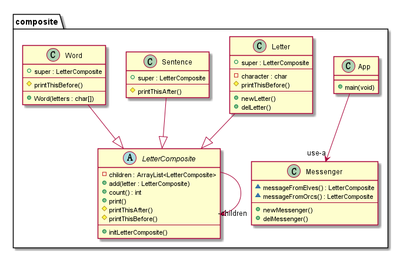

🌿 Composite
----------------
## Intent 
Compose objects into three structures to represent part-whole hierarchies.
Composite lets clients treat individual objects and compositions of objects uniformly.

## Explanation
Real world example
> Every sentence is composed of words which are in turn composed of characters.
> Each of these objects is printable and they can have something printed before or
> after them like sentence always ends with full stop and word always has space before it.

In plain words
> Composite pattern lets clients treat the individual objects in a uniform manner.

Wikipedia says
> In software engineering, the composite pattern is a partitioning design pattern. 
> The composite pattern describes that a group of objects is to be treated in the 
> same way as a single instance of an object. The intent of a composite is to "compose"
> objects into tree structures to represent part-whole hierarchies. Implementing the 
> composite pattern lets clients treat individual objects and compositions uniformly.

**Programmatic Example**

Taking our sentence example from above. Here we have the base class and different 
printable types

```c
class LetterComposite LetterComposite;
abstract class LetterComposite{
    private ArrayList *children;
    void (*add)(LetterComposite *self,LetterComposite *letter);
    int (*count)();
    void (*printThisBefore)();
    void (*printThisAfter)();
    /**
     * Print
     */
     void (*print)();
}LetterComposite;

/** @brief Base Method-----------------*/
protected static void printThisBefore0() {
}

protected static void printThisAfter0() {
}

public static void add(LetterComposite *self,LetterComposite *letter){
    self->children->append(self->children,letter);
}
public int count(LetterComposite *self){
    return self->children->size;
}
public void print(LetterComposite *self){
    self->printThisBefore(self);
    for (int i = 0; i < self->count(self); ++i) {
        LetterComposite* children = (self->children->get(self->children,i));
        children->print(children);
    }
    self->printThisAfter(self);
}

static LetterComposite super = {
        .add = add,
        .count = count,
        .print = print,
        .printThisBefore = printThisBefore0,
        .printThisAfter = printThisAfter0
    //    .children =? createArrayList(10)
};

LetterComposite *initLetterComposite(){
    super.children = createArrayList(10);
    return &super;
}


/**
 * Letter
 */
#define extends_LetterComposite
public class Letter extends_LetterComposite{
    LetterComposite super;
    char character;
}Letter;
Letter *newLetter(char c);
void delLetter(Letter *self);

/**
 * Letter
 */
/** @override-----------------------------*/
static void printThisBefore1(Letter *self){
    putchar(self->character);
}

/** @constuctor && @destructor------------*/
Letter *newLetter(char c){
    Letter *self = malloc(sizeof(Letter));
    self->character = c;
    self->super = *initLetterComposite();
    self->super.printThisBefore = printThisBefore1;
    return self;
}
void delLetter(Letter *self){
    if (self != NULL){
        free(self);
    }
}

/**
 * Word
 */
class Word extends_LetterComposite{
    LetterComposite super;
}Word;
//Word * newWord(ArrayList *letters);
Word * newWord1(char letters[],int size);
void delWord(Word *self);
/**
 * Word
 */
/** @override ---------------------*/
static void printThisBefore2(){
    printf(" ");
}
/*
Word *newWord( ArrayList *letters){
    Word *self = malloc(sizeof(Word));
    self->super = super;
    self->super.printThisBefore = printThisBefore2;
    for (int i = 0; i < letters->size; ++i) {
        self->super.add(&self->super,newLetter(letters->get(letters,i)));
    }
    return self;
}*/
Word * newWord1(char letters[],int size){
    Word *self = malloc(sizeof(Word));
    self->super = *initLetterComposite();
    self->super.printThisBefore = printThisBefore2;
    for (int i = 0; i < size; ++i) {
        self->super.add(&self->super,(LetterComposite*)newLetter(letters[i]));
    }
    return self;
}
void delWord(Word *self){
    if (NULL != self) {
        if (self->super.children != NULL){
            free(self->super.children);
        }
        free(self);
    }
}

/**
 * Sentence
 */
class Sentence extends_LetterComposite{
    LetterComposite super;
}Sentence;
Sentence *newSentence(ArrayList *words);
void delSentence(Sentence *self);

/**
 * Sentence.
 */
/** @override */
static void printThisAfter(){
    printf(".");
}
Sentence *newSentence(ArrayList *words){
    Sentence *self = malloc(sizeof(Sentence));
    self->super = *initLetterComposite();
    self->super.printThisAfter = printThisAfter;
    for (int i = 0; i < words->size; ++i) {
        self->super.add(&self->super,(LetterComposite*)words->get(words,i));
    }
    return self;
}
void delSentence(Sentence *self){
    if (NULL != self){
        if (self->super.children != NULL){
            for (int i = 0; i < self->super.children->size; ++i) {
                delWord(self->super.children->get(self->super.children,i));
            }
        }
        free(self);
    }
}
```
Then we have a messenger to carry messages
```c
/**
 * Messenger.
 */
class Messenger{
    LetterComposite *(*messageFromOrcs)();
    LetterComposite *(*messageFromElves)();
}Messenger;
Messenger *newMessenger(void);
void delMessenger(Messenger *self);

/**
 * Message
 */
/** @override-----------------------------*/
static LetterComposite *messageFromOrcs(){
    ArrayList *words = createArrayList(20);

    words->append(words,newWord1("Where",5));
    words->append(words,newWord1("there",5));
    words->append(words,newWord1("is",2));
    words->append(words,newWord1("whip",4));
    words->append(words,newWord1("there",5));
    words->append(words,newWord1("is",2));
    words->append(words,newWord1("a",1));
    words->append(words,newWord1("way",3));

    LetterComposite *self = (LetterComposite*)newSentence(words);
    deleteArrayList(words);
    return self;
}
static LetterComposite *messageFromElves(){
    ArrayList *words = createArrayList(20);

    words->append(words,newWord1("Much",4));
    words->append(words,newWord1("wind",4));
    words->append(words,newWord1("pours",5));
    words->append(words,newWord1("from",4));
    words->append(words,newWord1("your",4));
    words->append(words,newWord1("mouth",5));

    LetterComposite *self = (LetterComposite*)newSentence(words);
    deleteArrayList(words);
    return self;
}

/** @constuctor && @destructor------------*/
Messenger *newMessenger(void){
    Messenger *self = malloc(sizeof(Messenger));
    self->messageFromElves = messageFromElves;
    self->messageFromOrcs = messageFromOrcs;
    return self;
}
void delMessenger(Messenger *self){
    if (self != NULL){
        free(self);
    }
}
```

And then it can be used as 
```c
LetterComposite *orcMessage = newMessenger()->messageFromOrcs();
orcMessage->print(orcMessage);

LetterComposite *elfMessage = newMessenger()->messageFromElves();
elfMessage->print(elfMessage);

delSentence((Sentence*)orcMessage);
delSentence((Sentence*)elfMessage);
//note: need to release after newMessenger，or define a stack type(obj).  
```

## Class diagram


## Applicability
Use the Composite pattern when
* you want to represent part-whole hierarchies of objects
* you want clients to be able to ignore the difference 
between compositions of objects and individual objects.
Clients will treat all objects in the composite structure uniformly

## Real world example
* [java.awt.Container](http://docs.oracle.com/javase/8/docs/api/java/awt/Container.html) and [java.awt.Component](http://docs.oracle.com/javase/8/docs/api/java/awt/Component.html)

## Credits

* [Design Patterns: Elements of Reusable Object-Oriented Software](http://www.amazon.com/Design-Patterns-Elements-Reusable-Object-Oriented/dp/0201633612)