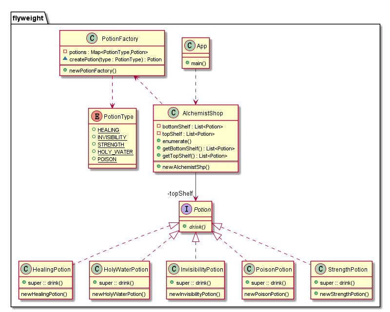

🍃 Flyweight

## Intent
Use sharing to support large numbers of fine-grained objects efficiently.

## Explanation
Real world example

> Alchemist's shop has shelves full of magic potions. Many of the potions are the same 
> so there is no need to create new object for each of them. Instead one object instance 
> can represent multiple shelf items so memory footprint remains small.

In plain words

> It is used to minimize memory usage or computational expenses by sharing as much as 
> possible with similar objects.

Wikipedia says

> In computer programming, flyweight is a software design pattern. A flyweight is an object 
> that minimizes memory use by sharing as much data as possible with similar objects; it is 
> a way to use objects in large numbers when a simple repeated representation would use an 
> unacceptable amount of memory. often some parts of the object state can be shared, and it 
> is common practice to hold them in external data structures and pass them to the flyweight
> objects temporarily when they are used.

**Programmatic example**

Translating our alchemist shop example from above. First of all we have different potion types

```c
/**
 * Interface for Potions
 */
public interface Potion{
    void (*drink)();
}Potion;

/**
 * HealingPotion
 */
#define implements_Potion
public class HealingPotion implements_Potion{
    Potion super;
}HealingPotion;
HealingPotion *newHealingPotion(void);
void delHealingPotion(HealingPotion *);
/**
 * HolyWaterPotion
 */
public class HolyWaterPotion implements_Potion{
    Potion super;
}HolyWaterPotion;
HolyWaterPotion *newHolyWaterPotion(void);
void delHolyWaterPotion(HolyWaterPotion*);
/**
 * InvisibilityPotion
 */
public class InvisibilityPotion implements_Potion{
    Potion super;
}InvisibilityPotion;
InvisibilityPotion *newInvisibilityPotion(void);
void delInvisibilityPotion(InvisibilityPotion*);

/**
 * PoisonPotion
 */
public class PoisonPotion implements_Potion{
    Potion super;
}PoisonPotion;
PoisonPotion *newPoisonPotion(void);
void delPoisonPotion(PoisonPotion *);
/**
 * StrengthPotion.
 */
public class StrengthPotion implements_Potion{
    Potion super;
}StrengthPotion;
StrengthPotion *newStrengthPotion(void);
void delStrengthPotion(StrengthPotion*);

/** definition here.*/
/**
 * HealingPotion
 */
/** @Override -----------*/
public static void drink(Potion *self){
    printf("You feel healed. (Potion = %d)\n",self);
}
/** @Constructor && @Destructor -----------------*/
public HealingPotion *newHealingPotion(){
    HealingPotion *self = malloc(sizeof(HealingPotion));
    self->super.drink = drink;
    return self;
}
public void delHealingPotion(HealingPotion *self){
    if (NULL != self){
        free(self);
    }
}

/**
 * HolyWaterPotion
 */
/** @Override ------------*/
public static void drink1(Potion *self){
    printf("You feel blessed. (Potion = %d)\n",self);
}
/** @Constructor && @Destructor -----------------*/
public HolyWaterPotion *newHolyWaterPotion(){
    HolyWaterPotion *self = malloc(sizeof(HolyWaterPotion));
    self->super.drink = drink1;
    return self;
}
public void delHolyWaterPotion(HolyWaterPotion *self){
    if (NULL != self)
        free(self);
}
/**
 * InvisibilityPotion
 */
/** @Override ------------*/
public static void drink2(Potion *self){
    printf("You become invisible. (Potion = %d)\n",self);
}
/** @Constructor && @Destructor -----------------*/
public InvisibilityPotion *newInvisibilityPotion(){
    InvisibilityPotion *self = malloc(sizeof(InvisibilityPotion));
    self->super.drink = drink2;
    return self;
}
public void delInvisibilityPotion(InvisibilityPotion *self){
    if (NULL != self){
        free(self);
    }
}

/**
 * HolyWaterPotion
 */
/** @Override ------------*/
public static void drink3(Potion *self){
    printf("Urgh! This is poisonous. (Potion = %d)\n",self);
}
/** @Constructor && @Destructor -----------------*/
public PoisonPotion *newPoisonPotion(){
    PoisonPotion *self = malloc(sizeof(PoisonPotion));
    self->super.drink = drink3;
    return self;
}
public void delPoisonPotion(PoisonPotion *self){
    if (NULL != self){
        free(self);
    }
}

/**
 * StrengthPotion.
 */
/** @Override -------------*/
public static void drink4(Potion *self) {
    printf("You feel strong. (Potion= %d)\n", self);
}
public StrengthPotion *newStrengthPotion(){\
    StrengthPotion* self = malloc(sizeof(StrengthPotion));
    self->super.drink = drink4;
    return self;
}
public void delStrengthPotion(StrengthPotion* self){
    if (NULL != self){
        free(self);
    }
}
```

Then the actual Flyweight object which is the factory for creating potions

```c
/**
 * PotionFactory
 */
/** @brief member method for PotionFactory---------------*/
public Potion *createPotion(PotionFactory *self,PotionType type){
    Potion *potion = self->potions->get(self->potions,type);
    if (potion == NULL){
        switch (type){
            case HEALING:
                potion = (Potion*)newHealingPotion();
                self->potions->put(self->potions,type,potion);
                break;
            case HOLY_WATER:
                potion = (Potion*)newHolyWaterPotion();
                self->potions->put(self->potions,type, potion);
                break;
            case INVISIBILITY:
                potion = (Potion*)newInvisibilityPotion();
                self->potions->put(self->potions,type,potion);
                break;
            case POISON:
                potion = (Potion*)newPoisonPotion();
                self->potions->put(self->potions,type,potion);
                break;
            case STRENGTH:
                potion = (Potion*)newStrengthPotion();
                self->potions->put(self->potions,type,potion);
                break;
            default:
                break;
        }
    }
    return potion;
}

/** --------*/
/**
 * PotionFactory is the Flyweight in this example. It minimizes memory use by
 * sharing object instances. It holds a map of potion instances and new potions
 * are created only when none of the type already exists.
 */
class PotionFactory PotionFactory;
public class PotionFactory{
    private HashMap *potions;
    Potion *(*createPotion)(PotionFactory *self,PotionType type);
}PotionFactory;
public PotionFactory *newPotionFactory(void);
public void delPotionFactory(PotionFactory *self);

/**
 * PotionFactory
 */
/** @brief member method for PotionFactory---------------*/
public Potion *createPotion(PotionFactory *self,PotionType type){
    Potion *potion = self->potions->get(self->potions,type);
    if (potion == NULL){
        switch (type){
            case HEALING:
                potion = (Potion*)newHealingPotion();
                self->potions->put(self->potions,type,potion);
                break;
            case HOLY_WATER:
                potion = (Potion*)newHolyWaterPotion();
                self->potions->put(self->potions,type, potion);
                break;
            case INVISIBILITY:
                potion = (Potion*)newInvisibilityPotion();
                self->potions->put(self->potions,type,potion);
                break;
            case POISON:
                potion = (Potion*)newPoisonPotion();
                self->potions->put(self->potions,type,potion);
                break;
            case STRENGTH:
                potion = (Potion*)newStrengthPotion();
                self->potions->put(self->potions,type,potion);
                break;
            default:
                break;
        }
    }
    return potion;
}
public static void delPotion(PotionType type,Potion *potion){
    switch(type){
        case HEALING:
            if (NULL != potion) {
                delHealingPotion((HealingPotion *) potion);
                potion = NULL;
            }
            break;
        case HOLY_WATER:
            if (NULL != potion) {
                delHolyWaterPotion((HolyWaterPotion*)potion);
                potion = NULL;
            }
            break;
        case INVISIBILITY:
            if (NULL != potion) {
                delInvisibilityPotion((InvisibilityPotion *)potion);
                potion = NULL;
            }
            break;
        case POISON:
            if (NULL != potion) {
                delPoisonPotion((PoisonPotion*)potion);
                potion = NULL;
            }
            break;
        case STRENGTH:
            if (NULL != potion) {
                delStrengthPotion((StrengthPotion*)potion);
                potion = NULL;
            }
            break;
        default:
            break;
    }
}

public PotionFactory *newPotionFactory(void){
    PotionFactory *self = malloc(sizeof(PotionFactory));
    self->potions = createHashMap();
    self->createPotion = createPotion;
    return self;
}
public void delPotionFactory(PotionFactory *self){
    if (self != NULL){
        if (self->potions != NULL){
         //   self->potions->forEach(self->potions,delPotion);
            freeHashMap(self->potions);
        }
        free(self);
    }
}
```
And it can be used as below

```c
PotionFactory *factory = newPotionFactory();
factory->createPotion(factory,INVISIBILITY).drink(); // You become invisible. (Potion = 9787120)
factory->createPotion(factory,HEALING).drink(); // You feel healed. (Potion = 9787344)
factory->createPotion(factory,INVISIBILITY).drink(); // You become invisible. (Potion = 9787120)
factory->createPotion(factory,HOLY_WATER).drink(); // You feel blessed.  (Potion = 9787568)
factory->createPotion(factory,POISON).drink(); // Urgh! This is poisonous. (Potion = 9787456)
factory->createPotion(factory,HOLY_WATER).drink(); // You feel blessed. (Potion = 9787568)
```

## Class diagram


## Applicability
The Flyweight pattern's effectiveness depends heavily on how and where it's used.
Apply the Flyweight pattern when all of the following are true

* an application uses a large number of objects 
* storage costs are high because of the sheer quantity of objects most object state 
can be made extrinsic
* many groups of objects may be replaced by relatively few shared objects once extrinsic 
state is removed
* the application doesn't depend on object identity. Since flyweight objects may be shared,
identity tests will return true for conceptually distinct objects.

## Real world example
*  [java.lang.Integer#valueOf(int)](http://docs.oracle.com/javase/8/docs/api/java/lang/Integer.html#valueOf%28int%29) and similarly for Byte, Character and other wrapped types.
 
## Credits

* [Design Patterns: Elements of Reusable Object-Oriented Software](http://www.amazon.com/Design-Patterns-Elements-Reusable-Object-Oriented/dp/0201633612)

