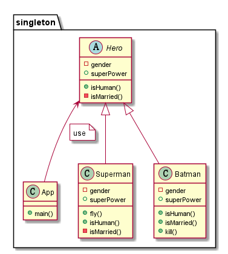

💍 Singleton
----------------
## Intent
Ensure a class only have one instance, and provide a
global point of access to it.

## Explanation
Real word example

> There can only be one ivory where the wizards study their magic.
> The same enchanted ivory tower is always used by the wizards. Ivory tower
> here is singleton.

In plain words

> Ensure that only one object of a particular class is ever created.

Wikipedia says

> In software engineering, the singleton pattern is a software design pattern that
> restricts the instantiation of a class to one object. This is useful when exactly 
> one object is needs to coordinate actions across the system.

**Programmatic Example**

## Class diagram

## Applicability
Use the Singleton pattern when

* There must 

